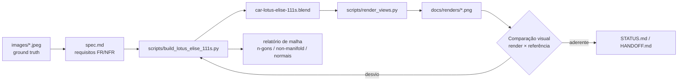

# Lotus Elise 111S — modelo 3D em Blender

Modelo 3D do **Lotus Elise 111S (Series 1)** em azul metálico profundo, construído de forma **procedimental** em Blender
via `bpy`, com topologia quad-dominant apta a Sub-D, nomenclatura por categoria e metadados para troca automatizada de
material. Todo o processo é conduzido por scripts e executado através do Model Context Protocol (`blender-mcp`).

## Objetivo

Produzir um modelo de escala real (3,726 m × 1,718 m × 1,117 m) cuja geometria e materiais reproduzam as
características estruturais do 111S — arcos de roda reais, rodas de 6 raios, carcaças de farol, entradas de ar laterais
em geometria real, waistline ascendente, emblema traseiro `111S` — com verificação por comparação visual contra as
imagens de referência.

## Requisitos

- Blender **5.2.1 LTS** (engine `BLENDER_EEVEE`).
- Extensão/servidor MCP `blender-mcp` configurado em `.vscode/mcp.json` (opcional para uso fora do VS Code).
- Nenhuma dependência Python externa.

## Como executar

### 1. Construir o modelo

```bash
blender --background car-lotus-elise-111s.blend --python scripts/build_lotus_elise_111s.py
```

O script é **idempotente**: limpa a cena, reconstrói todo o modelo, materiais, rig de verificação e câmeras, emite o
relatório de malha e salva `car-lotus-elise-111s.blend`.

### 2. Gerar os renders de verificação

```bash
blender --background car-lotus-elise-111s.blend --python scripts/render_views.py
```

Saída em `docs/renders/`: `01_frontal.png`, `02_superior.png`, `03_lateral.png`, `04_traseira.png`,
`05_three_quarter.png`, `06_three_quarter_rear.png`, `07_wheel_closeup.png` e as vistas de topologia
`10_clay_lateral.png` / `11_clay_three_quarter.png`.

### 3. Relatório de malha

```bash
blender --background car-lotus-elise-111s.blend --python scripts/mesh_report.py
```

### 4. Uso via MCP (VS Code)

Executar o build dentro da sessão do Blender aberta:

```python
exec(open("scripts/build_lotus_elise_111s.py").read())
```

## Estrutura de diretórios

```text
.
├── AGENTS.md                  # regras permanentes do projeto
├── STATUS.md                  # estado atual do desenvolvimento
├── HANDOFF.md                 # continuidade entre agentes
├── .specs/                    # SDD: constituição, spec, design, tasks
├── car-lotus-elise-111s.blend # modelo (gerado)
├── docs/
│   ├── descricao.txt          # especificação técnica original
│   └── renders/               # evidência visual (gerada)
├── images/                    # referências visuais (ground truth)
└── scripts/                   # build, relatório e render
```

## Fluxo



## Escopo e limitações

- **Verificação**: visual comparativa. Não há suíte de testes automatizados (decisão do usuário).
- **Fora de escopo**: rig de iluminação de estúdio completo, HDRI, validação automatizada de Zebra/Isophotes,
  interior completo (versão simplificada), exportação para outros formatos.
- Sem blueprints ortográficos: as proporções derivam das fotos, com desvio esperado de poucos centímetros.

## Documentação

| Arquivo | Conteúdo |
|---|---|
| `docs/descricao.txt` | especificação técnica original do cliente |
| `.specs/features/lotus-elise-111s-model/spec.md` | requisitos, critérios de aceite e rastreabilidade |
| `.specs/features/lotus-elise-111s-model/design.md` | decisões técnicas, dimensões de referência e ADRs |
| `.specs/features/lotus-elise-111s-model/tasks.md` | tarefas e entregáveis |
| `AGENTS.md` | regras permanentes para agentes |
| `STATUS.md` | estado atual |
| `HANDOFF.md` | transferência entre sessões |

## Licença

Distribuído sob a **Apache License 2.0**. Consulte [`LICENSE`](LICENSE) — Copyright 2026 William da Silva Vianna.
