# Lotus Elise 111S — modelo 3D em Blender

Modelo 3D do **Lotus Elise 111S (Series 1)** em azul metálico profundo, construído de forma **procedimental** em Blender
via `bpy`, com topologia quad-dominant apta a Sub-D, nomenclatura por categoria e metadados para troca automatizada de
material. Todo o processo é conduzido por scripts e executado através do Model Context Protocol (`blender-mcp`).

## Objetivo

Produzir um modelo de escala real (3,726 m × 1,718 m × 1,117 m) cuja geometria e materiais reproduzam as
características estruturais do 111S — arcos de roda reais, rodas de 6 raios, carcaças de farol, entradas de ar laterais
em geometria real, waistline ascendente, emblema traseiro `111S` — com verificação por comparação visual contra as
imagens de referência.

## Galeria do modelo gerado

Imagens produzidas pelo próprio pipeline (`scripts/render_gallery.py`, EEVEE 96 amostras, 1500×1000) e versionadas na
pasta `images/`.

<table>
  <tr>
    <td width="50%">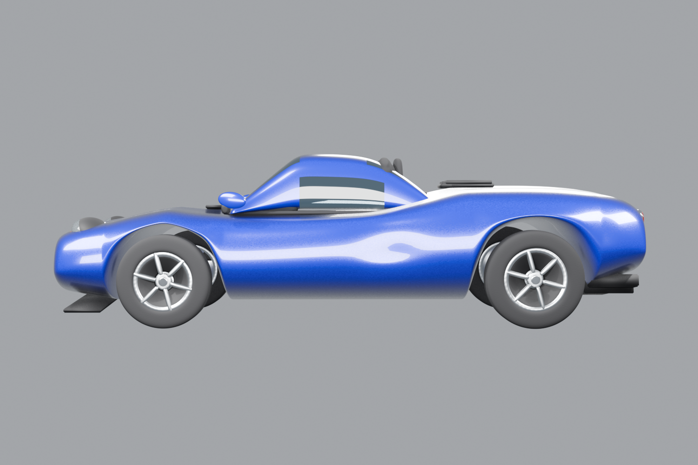<br><sub><b>Lateral</b> — silhueta, arcos de roda e rodas de 6 raios</sub></td>
    <td width="50%">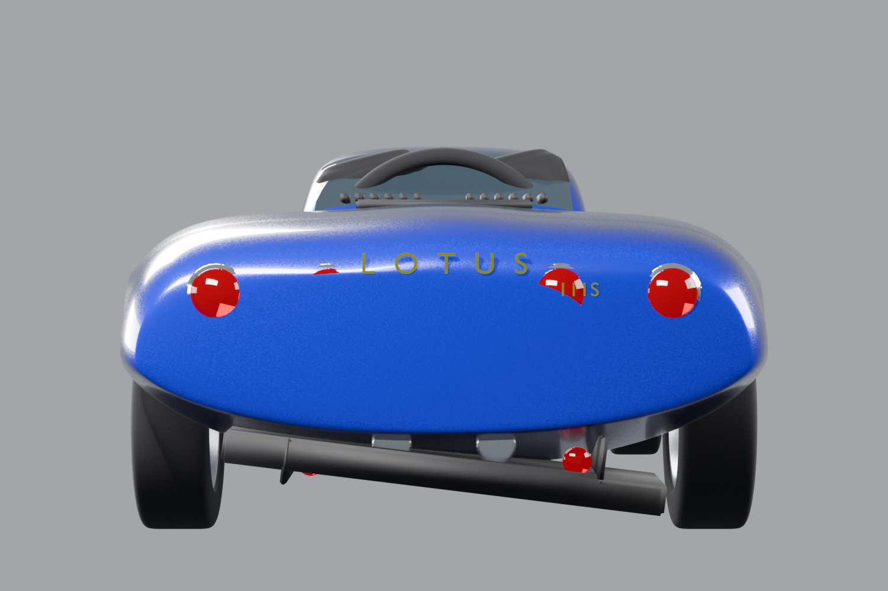<br><sub><b>Traseira</b> — 4 lanternas, emblemas LOTUS/111S, difusor e escapes</sub></td>
  </tr>
  <tr>
    <td width="50%">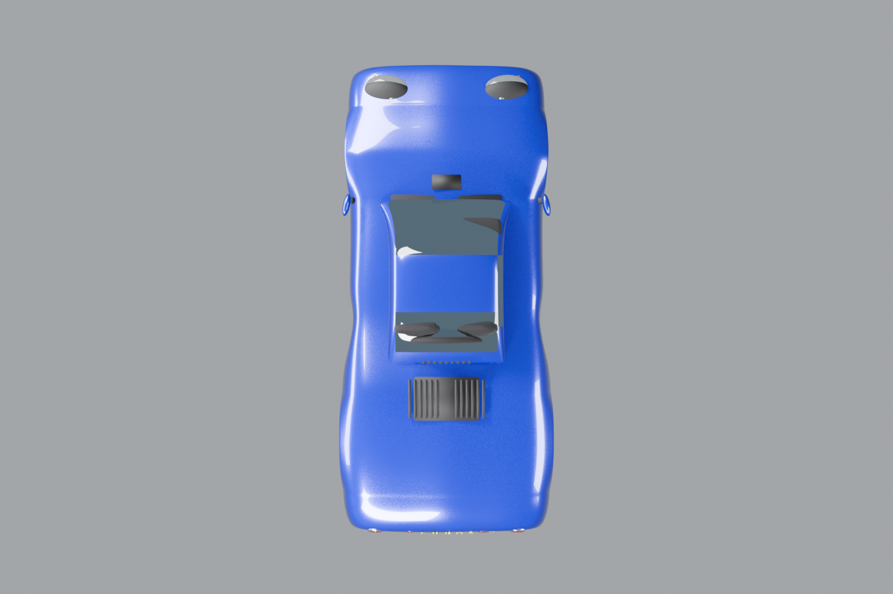<br><sub><b>Superior</b> — entradas de ar laterais, louvers do engine cover e cabine</sub></td>
    <td width="50%">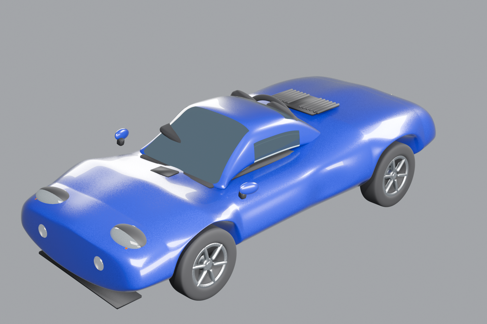<br><sub><b>Isométrica</b> — leitura de volume e superfícies de Sub-D</sub></td>
  </tr>
  <tr>
    <td colspan="2">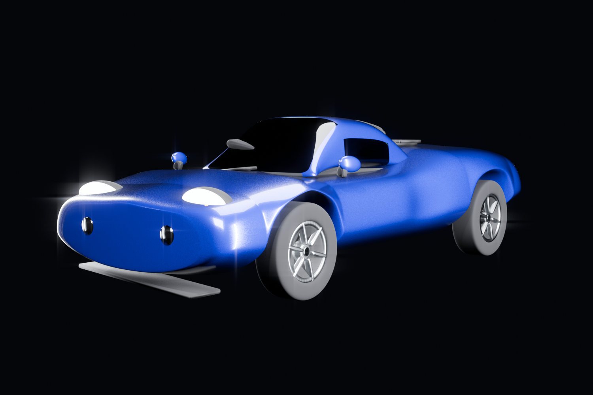<br><sub><b>Efeito de luz</b> — rim lights laterais, faróis acesos e bloom no compositor (Glare)</sub></td>
  </tr>
</table>

## Referências visuais (ground truth)

Fotografias do veículo real em `images/`, usadas como referência de proporção, morfologia e cor.

<table>
  <tr>
    <td width="33%">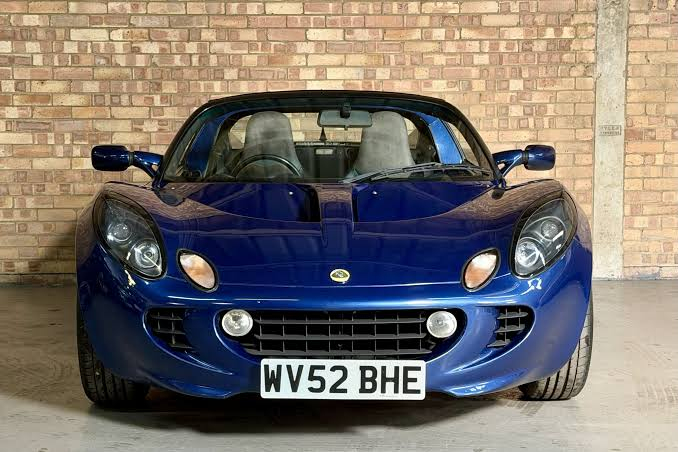<br><sub>Frontal</sub></td>
    <td width="33%">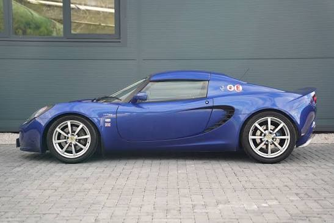<br><sub>Lateral</sub></td>
    <td width="33%">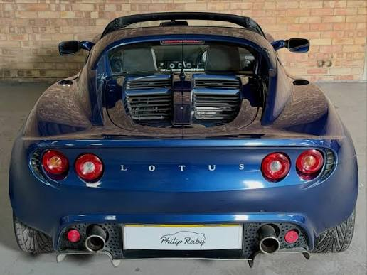<br><sub>Traseira</sub></td>
  </tr>
  <tr>
    <td width="33%">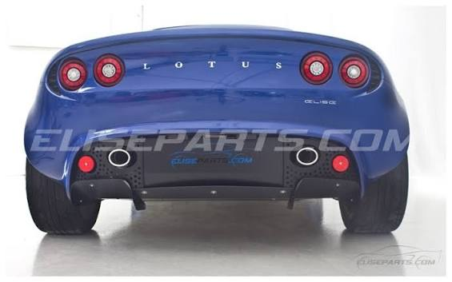<br><sub>Traseira (3/4)</sub></td>
    <td width="33%">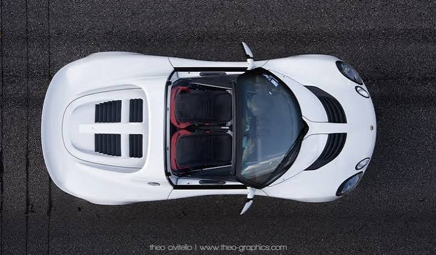<br><sub>Superior</sub></td>
    <td width="33%"><br><sub>3/4 com pintura azul</sub></td>
  </tr>
</table>

A comparação render × referência fica registrada em `docs/renders/` (ver `SUMMARY.md` para a tabela de aceite).

## Requisitos

- Blender **5.2.1 LTS** (engine `BLENDER_EEVEE`).
- Extensão/servidor MCP `blender-mcp` configurado em `.vscode/mcp.json` (opcional para uso fora do VS Code).
- Nenhuma dependência Python externa.

## Como executar

### 1. Construir o modelo

```bash
blender --background car-lotus-elise-111s.blend --python scripts/build_lotus_elise_111s.py
```

O script é **idempotente**: limpa a cena, reconstrói todo o modelo, materiais, rig de verificação e câmeras, emite o
relatório de malha e salva `car-lotus-elise-111s.blend`.

### 2. Gerar a galeria de apresentação

```bash
blender --background car-lotus-elise-111s.blend --python scripts/render_gallery.py
```

Saída em `images/`: `modelo3d-superior.png`, `modelo3d-traseira.png`, `modelo3d-lateral.png`,
`modelo3d-isometrica.png` e `modelo3d-efeitoluz.png` (esta última com rig dramático de rim lights, faróis acesos e
bloom via nó `Glare` no compositor). O script **não salva** o `.blend`: o rig neutro é restaurado ao final.

### 3. Gerar os renders de verificação

```bash
blender --background car-lotus-elise-111s.blend --python scripts/render_views.py
```

Saída em `docs/renders/`: `01_frontal.png`, `02_superior.png`, `03_lateral.png`, `04_traseira.png`,
`05_three_quarter.png`, `06_three_quarter_rear.png`, `07_wheel_closeup.png` e as vistas de topologia
`10_clay_lateral.png` / `11_clay_three_quarter.png` — cada uma confrontada com a referência correspondente.

### 4. Relatório de malha

```bash
blender --background car-lotus-elise-111s.blend --python scripts/mesh_report.py
```

### 5. Uso via MCP (VS Code)

Executar o build dentro da sessão do Blender aberta:

```python
exec(open("scripts/build_lotus_elise_111s.py").read())
```

### 6. Compilar a monografia

```bash
cd monografia && ./build.sh     # pdflatex → bibtex → pdflatex ×2
```

Requer `pdflatex` e `bibtex` (TeX Live). O PDF sai em `monografia/main.pdf`; o script imprime
erros, referências indefinidas, contagem de overfull e número de páginas. Os diagramas são
regenerados com `mmdc -p diagrams/pptr.json -i diagrams/x.mmd -o diagrams/x.png`.

## Estrutura de diretórios

```text
.
├── AGENTS.md                  # regras permanentes do projeto
├── STATUS.md                  # estado atual do desenvolvimento
├── HANDOFF.md                 # continuidade entre agentes
├── .specs/                    # SDD: constituição, spec, design, tasks, summary
├── car-lotus-elise-111s.blend # modelo (gerado)
├── docs/
│   ├── descricao.txt          # especificação técnica original
│   └── renders/               # evidência visual da verificação (gerada)
├── images/                    # referências do cliente + galeria do modelo
│   ├── *.jpeg                 # referências (ground truth)
│   └── modelo3d-*.png         # imagens geradas no Blender (versionadas)
├── monografia/                # monografia em LaTeX (abnt/memoir) + PDF
│   ├── main.tex               # arquivo principal
│   ├── chapters/ appendices/  # capítulos e apêndices
│   ├── diagrams/              # diagramas Mermaid (.mmd) e PNG
│   ├── figures/               # referências, renders e galeria usados no texto
│   ├── references.bib         # 49 referências verificáveis
│   ├── build.sh               # pdflatex → bibtex → pdflatex ×2
│   └── main.pdf               # monografia compilada (94 páginas)
└── scripts/                   # build, galeria, verificação e relatório
```

Os renders PNG (`images/modelo3d-*.png` e `docs/renders/*.png`) são **entregáveis e permanecem versionados** — o
`.gitignore` só descarta backups (`*.blend1`), caches (`__pycache__/`) e temporários (`*.png.tmp`).

## Fluxo

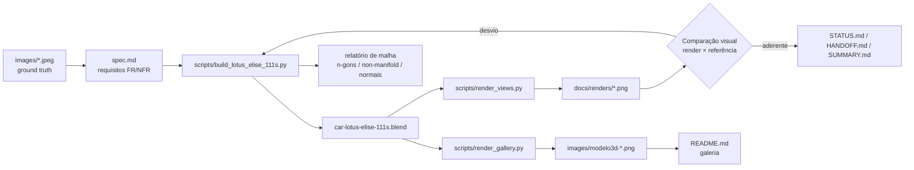

## Escopo e limitações

- **Verificação**: visual comparativa. Não há suíte de testes automatizados (decisão do usuário).
- **Fora de escopo**: rig de iluminação de estúdio completo, HDRI, validação automatizada de Zebra/Isophotes,
  interior completo (versão simplificada), exportação para outros formatos.
- Sem blueprints ortográficos: as proporções derivam das fotos, com desvio esperado de poucos centímetros.

## Documentação

| Arquivo | Conteúdo |
|---|---|
| `docs/descricao.txt` | especificação técnica original do cliente |
| `.specs/features/lotus-elise-111s-model/spec.md` | requisitos, critérios de aceite e rastreabilidade |
| `.specs/features/lotus-elise-111s-model/design.md` | decisões técnicas, dimensões de referência e ADRs |
| `.specs/features/lotus-elise-111s-model/tasks.md` | tarefas e entregáveis |
| `AGENTS.md` | regras permanentes para agentes |
| `STATUS.md` | estado atual |
| `HANDOFF.md` | transferência entre sessões |
| `monografia/main.pdf` | monografia compilada (94 páginas) |
| `monografia/MONOGRAFIA_STATUS.md` | estado da monografia e métricas do PDF |
| `monografia/MONOGRAFIA_EVIDENCIAS.md` | matriz afirmação → evidência → seção |
| `monografia/MONOGRAFIA_RASTREABILIDADE.md` | objetivo → método → evidência → status |
| `monografia/MONOGRAFIA_PENDENCIAS.md` | pendências e informações ausentes |

## Licença

Distribuído sob a **Apache License 2.0**. Consulte [`LICENSE`](LICENSE) — Copyright 2026 William da Silva Vianna.
